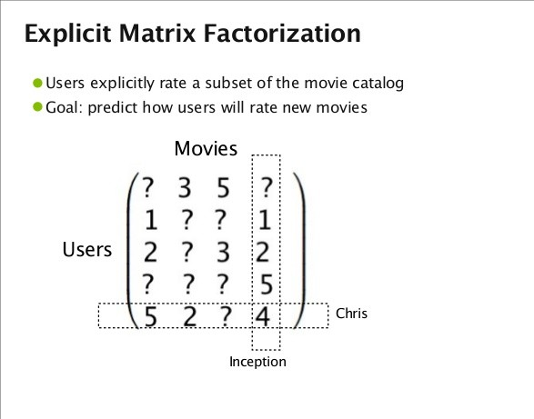

# Recommendation Engine

 A recommendation algorithm implemented with `Biased Matrix Factorization`(collaborative filtering) method which is tested over `1 million movielens dataset` with state-of-the-art `validation RMSE around ~ 0.83-0.84` and modified movielns dataset during Capillary Technology Data Science Challenge for recommending 5 movies to 2245 test users.



## Getting Started

These instructions will get you a copy of the project up and running on your local machine for development and testing purposes.

### Prerequisites


* [Tensorflow](https://www.tensorflow.org/install/) - Used in Deep Neural Network to create models
* [Numpy](http://www.numpy.org/) - Multidimensioanl Mathematical Computing 
* [Pandas](http://pandas.pydata.org/pandas-docs/version/0.18.0/) - Used to load dataset
* [Matplotlib](https://matplotlib.org/contents.html) - Used to plot Graph


### Installing

Clone the repository

```
git clone https://github.com/zishansami102/Recommendation-Engine
```
Run the following command to start training model with movie lens data

```
python train.py
```

Run the following command to start training model with Capillary Technology modified movie lens data

```
python captrain.py
```

Run the following command to generate a file which test the recommended ratings to the users in training dataset.

```
python run.py
```
To train for new unknown user, edit the movieId and ratings in retrain.py to observe the predicted ratings on modified dataset 

```
python retrain.py
```


## Contributing

Contributions are welcome of course ;)


